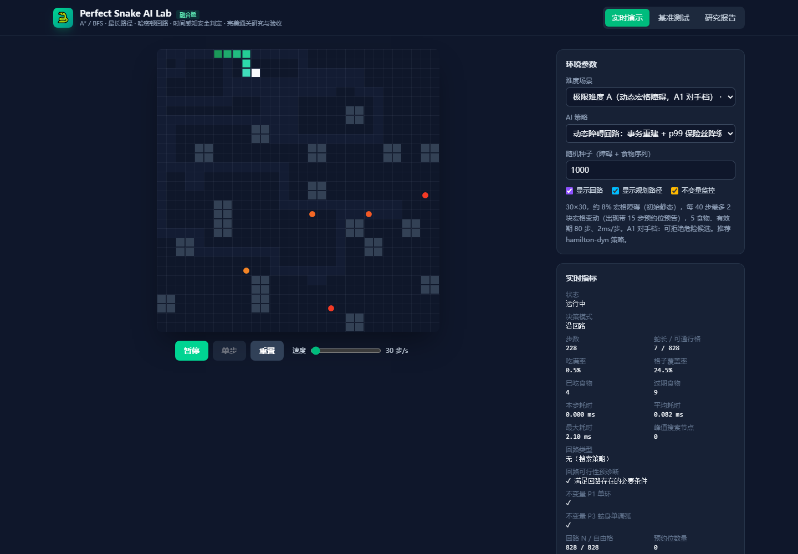

# Perfect Snake AI Lab

[](https://github.com/heimixieb/perfect-snake-ai-lab/actions/workflows/ci.yml)
[](https://www.typescriptlang.org/)
[](LICENSE)

> 不只让蛇吃满棋盘，还要能回答：**为什么安全、失败在哪里、数字怎样复现。**

一个可交互、可测试、可做实验的贪吃蛇算法实验室。项目把哈密顿回路、单调序捷径、动态障碍维护、2-factor 修复和独立影子校验放进同一套无 DOM 引擎，并用固定 seed 的命令行实验与 CI 检查结果。

English: a reproducible, certifying Snake-AI lab for static and changing grids. The UI is the demo; the headless engine and verification scripts are the product.



## 30 秒开始

需要 Node.js 20 或更高版本。

```bash
npm ci
npm run dev       # 打开交互演示
npm run verify    # 类型检查、构建、性质测试、影子校验、故障注入、动态正确性门
```

只想看算法跑一轮：

```bash
npx tsx scripts/bench-dyn.ts 10 7000 --correctness-only
```

## 为什么这个仓库值得看

- **可证明的安全骨架**：能构造回路时，蛇身沿单调弧前进；捷径只有在不越过尾部安全裕量时才启用。
- **真的会变化的地图**：障碍经历“候选 → 预约 → 落地/解除 → 回路重建”，不是预生成的静态关卡。
- **先验证，再提交**：动态回路在候选数组上完成邻接、唯一性与单环检查，成功后才原子替换正式状态。
- **第二只眼**：影子实现从当前网格独立重建，检查支持集、单环、蛇身单调弧与参考回路可构造性。
- **失败也有名字**：碰撞、无合法移动、饥饿、维护失败和步数上限分开记录；不会把超时悄悄算成成功。
- **正确性和性能分门**：CI 使用确定性正确性门；墙钟性能在固定硬件上单独验收，避免共享 runner 抖动制造假回归。

## 目前究竟证明了什么

项目刻意区分“性质”“诊断指标”和“实验结果”：

| 名称 | 精确定义 | 是否作为正确性门 |
|---|---|---:|
| `win` | 蛇长达到**当前**自由格数 | 是 |
| 安全 S | 不撞墙、自身、障碍，不产生非法移动或维护失败 | 是 |
| 初始容量比例 | `finalLength / initialFreeCount` | 否，未提供 `structural_L` 证书时只是诊断量 |
| 到期快照可达性 | 食物 TTL 到期时，在当前静态快照中是否可达 | 否，它不是“不饿死”证明 |
| V 覆盖率 | `visited ∩ 当前自由集 / 当前自由集` | 报告 |
| pooled 决策 p99 | 合并全部决策样本后计算 p99 | 本地性能门；CI 仅报告 |

这一区分很重要：动态障碍减少自由格会降低当前棋盘的胜利目标；静态连通也不代表食物一定能在 TTL 内吃到。仓库不会把两者包装成更强的定理。

## 动态对手模型

- **A1**：危险候选可被调度器过滤，带预约期。
- **A2-like**：允许靠近蛇头的候选，并检查逃逸集、预告期和落地后连通性。
- **严格 A2 尚未实现**：当前维护器仍可拒绝一个通过公平性检查的候选。

所有动态基准都会打印完整漏斗：抽样数、环境过滤、公平性过滤、策略拒绝、预约、提交、回滚和解除放弃。因此，“成功落地很多次”不会掩盖前置拒绝。

```bash
npx tsx scripts/bench-dyn.ts 20 7000 --a2 --correctness-only
npx tsx scripts/a2-matrix.ts 10 7000
```

## 验证矩阵

| 命令 | 检查内容 |
|---|---|
| `npm run typecheck` | `src/` 与 `scripts/` 的严格 TypeScript 检查 |
| `npm run build` | 生成单文件 Web 应用 `dist/index.html` |
| `npm run test:property` | 随机增删宏格后检查单环、序号、支持集和覆盖 |
| `npm run test:shadow` | 独立重建与四层 refinement 检查 |
| `npm run test:fault` | 重建失败、单调弧拒绝、强制降级、极端时钟等故障注入 |
| `npm run test:twofactor` | 2-factor 求解、圈合并与增量修复专项验收 |
| `npm run bench:dyn` | 100 seeds 动态正确性 + 本机性能门 |
| `npm run bench:dyn:correctness` | 20 seeds 动态正确性门，墙钟仅报告 |

固定 seed 保证事件序列和逻辑结果可复现；耗时仍受 CPU、JIT（即时编译）、GC（垃圾回收）与系统负载影响。

本次候选版本的完整验证已通过：A1 动态场景 20/20 局通关、0 个安全失败，pooled 决策 p99 为 0.8927ms；硬件、命令、事件筛选漏斗与 2-factor 差分结果见 [验证快照](docs/benchmarks.md)。这些是给定环境和样本的实验结果，不是总体成功率证明。

## 架构

```text
src/engine/            无 DOM 核心，可在浏览器与 Node.js 复用
├── game.ts            状态机、碰撞、食物与指标
├── hamilton.ts        静态哈密顿回路构造
├── dyn.ts             动态回路、事务提交、调度器与降级控制
├── twofactor.ts       2-factor 求解、圈合并与局部修复
├── strategies.ts      策略组合与安全捷径
└── shadow.ts          独立参考校验器

src/components/        交互演示、基准面板与研究报告
scripts/               可复现实验和验收入口
.github/workflows/     GitHub Actions 正确性门
```

更多细节见 [验证语义](docs/verification.md)、[架构说明](docs/architecture.md)、[验证快照](docs/benchmarks.md) 和 [贡献指南](CONTRIBUTING.md)。

## 已知边界

- 任意单格障碍上的哈密顿路径问题在一般情形下很难；这里的启发式实验不能由 NP-完备性直接解释。
- 奇数顶点的二分网格图不存在覆盖全部顶点的哈密顿回路；“累计访问全部格”不等于“同时吃满”。
- 当前经典动态引擎使用 O(N) 全量重建；这只是本实现选择，不宣称是所有维护模型中唯一正确的方法。
- 第三方 DQN 与图搜索数字来自不同规则，不能推出“强化学习不适用”。本项目只是优先选择更容易构造和检查安全不变量的图算法。
- A2-like 仍有策略拒绝；严格承诺落地、逃逸锁定与对应活性证明列在路线图中。

## 参与贡献

欢迎提交新的构造器、反例、性质测试或可复现实验。涉及性能的 PR 请同时提交固定硬件信息、命令、seed 范围和原始摘要；涉及正确性声明的 PR 请明确它属于推导、运行时验证还是实验观察。

请先阅读 [CONTRIBUTING.md](CONTRIBUTING.md) 与 [SECURITY.md](SECURITY.md)。

## 致谢与参考

- John Tapsell 的 Hamiltonian Snake 思路
- `chuyangliu/snake` 的图搜索策略实现
- Itai、Papadimitriou、Szwarcfiter 关于网格图哈密顿问题的经典工作
- R. Gould 关于动态图哈密顿问题的综述

## License

[MIT](LICENSE) © Perfect Snake AI Lab contributors
