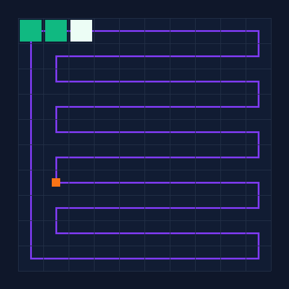
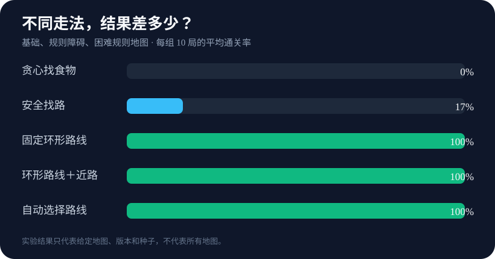
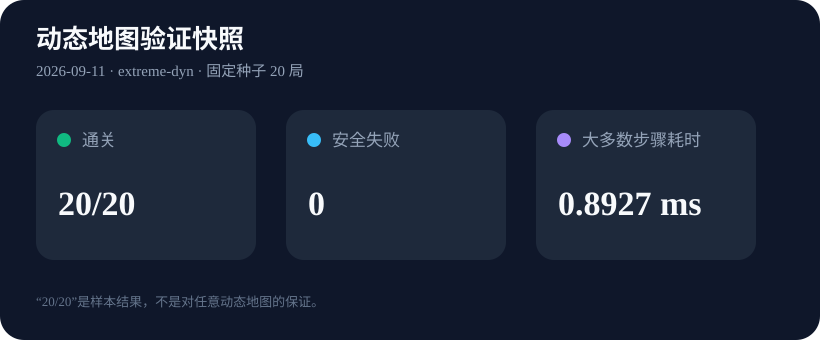
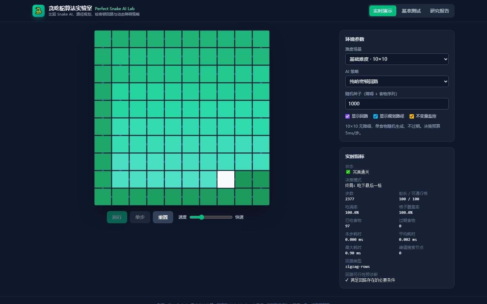
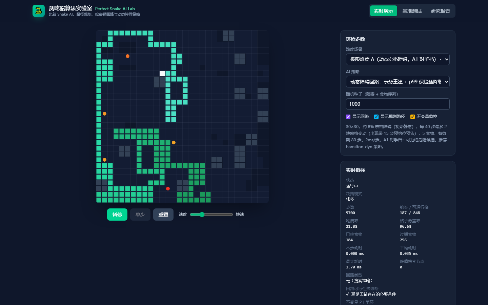
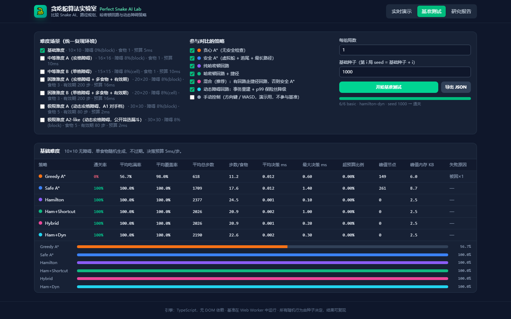

# 贪吃蛇算法实验室｜Perfect Snake AI Lab

<p align="right"><strong>简体中文</strong> · <a href="README_EN.md">English</a></p>

[](https://github.com/heimixieb/perfect-snake-ai-lab/actions/workflows/ci.yml)
[](https://heimixieb.github.io/perfect-snake-ai-lab/)
[](https://github.com/heimixieb/perfect-snake-ai-lab/stargazers)
[](LICENSE)

这是一个可以在线玩的**贪吃蛇算法**实验室：比较不同的**贪吃蛇 AI**（Snake AI）怎样找食物、怎样做**路径规划**，以及怎样用**哈密顿回路**应对规则地图；项目还包含会变化的**动态障碍**场景。

[](https://heimixieb.github.io/perfect-snake-ai-lab/)

<p align="center">
  <a href="https://heimixieb.github.io/perfect-snake-ai-lab/"><strong>▶ 立即在线体验</strong></a>
  ·
  <a href="docs/RESEARCH.md">阅读完整研究报告</a>
</p>

## 它到底是什么？

这是一个会自己玩贪吃蛇的网页实验室。你可以让几种不同的电脑玩家挑战同一张地图，看看谁更安全、谁更快、谁能吃得更多。

- 支持直接找食物、安全找路、固定环形路线、自动选择路线和手动操作。
- 在能铺出完整环形路线的规则地图上，基础走法有明确的安全理由。
- 可以观看障碍提前出现预告、路线重新安排和蛇绕开危险区域。
- 内置统一比赛和自动检查，不只展示最好看的一局。
- 所有随机地图都能用同一个数字重新生成，方便别人核对结果。

## 它是怎么通关的？

想象棋盘上有一条经过所有格子的环形跑道。蛇只要一直沿着跑道前进，头部就不会突然撞上自己的身体，因为尾巴会在前方到达之前逐渐让出位置。

程序先画好这条跑道，再让蛇沿着它找食物。遇到确认安全的机会时，蛇可以抄近路；如果近路可能把自己困住，它就继续走原来的跑道。

## 怎么知道它真的有效？

项目不是只录一局成功视频，而是做了四层检查：

1. **先检查路线**：路线必须经过目标格子，每一步都必须走到相邻格子。
2. **变化前先试走**：地图变化时，先在备用路线里检查，确认没有问题才正式换过去。
3. **再找一位“检查员”**：另一段独立代码重新计算，避免主程序自己检查自己时一起犯错。
4. **反复制造麻烦**：自动生成随机变化，还故意让重建失败、让电脑变慢，确认程序会安全停止或继续运行。

每次提交代码，GitHub 都会自动运行这些检查。当前验证快照包含 10,001 次随机路线检查、200 局故障测试和 20 局动态地图测试；详细命令与边界见 [验证快照](docs/benchmarks.md)。





## 有哪些限制？

- “安全吃满”只适用于能够铺出完整环形路线的规则地图，不是任意地图都成立。
- 随机单格障碍可能把地图切成无法全部走遍的形状，此时程序只能尽量多吃。
- 动态障碍必须提前通知，而且当前程序可以拒绝一部分太危险的变化。
- “20 局全部成功”只是这 20 个样本的结果，不代表所有动态地图都不会失败。
- 运行速度会受电脑、浏览器和后台程序影响，因此时间数据不能跨机器逐位相同。

## 30 秒开始

需要 Node.js 20 或更高版本。

```bash
git clone https://github.com/heimixieb/perfect-snake-ai-lab.git
cd perfect-snake-ai-lab
npm ci
npm run dev
```

运行全部自动检查：

```bash
npm run verify
```

重新生成首页 GIF 和数据图：

```bash
npm run assets
```

## 截图

| 规则地图：沿环形路线前进 | 动态地图：障碍提前预告 |
|---|---|
|  |  |



<details>
<summary><strong>想继续深挖算法和证明？</strong></summary>

这个项目的技术名称包括：图搜索、哈密顿回路、单调顺序捷径、动态路线重建、2-factor 实验引擎、性质测试、故障注入和影子验证。

- [完整研究报告](docs/RESEARCH.md)：原网页报告的 0–10 节 Markdown 版本。
- [验证语义](docs/verification.md)：每个指标究竟能证明什么、不能证明什么。
- [架构说明](docs/architecture.md)：游戏引擎、网页和测试脚本怎样分工。
- [验证快照](docs/benchmarks.md)：机器、命令、样本数和最新公开结果。

</details>

## 参与贡献

欢迎提交新的走法、反例、测试或界面改进。开始前请阅读 [CONTRIBUTING.md](CONTRIBUTING.md)；发现安全问题请查看 [SECURITY.md](SECURITY.md)。

## Star History

[](https://star-history.com/#heimixieb/perfect-snake-ai-lab&Date)

## 致谢

- John Tapsell 的 Hamiltonian Snake 思路
- `chuyangliu/snake` 的图搜索策略实现
- 研究网格路线问题的经典论文与动态图综述

## License

[MIT](LICENSE) © Perfect Snake AI Lab contributors
